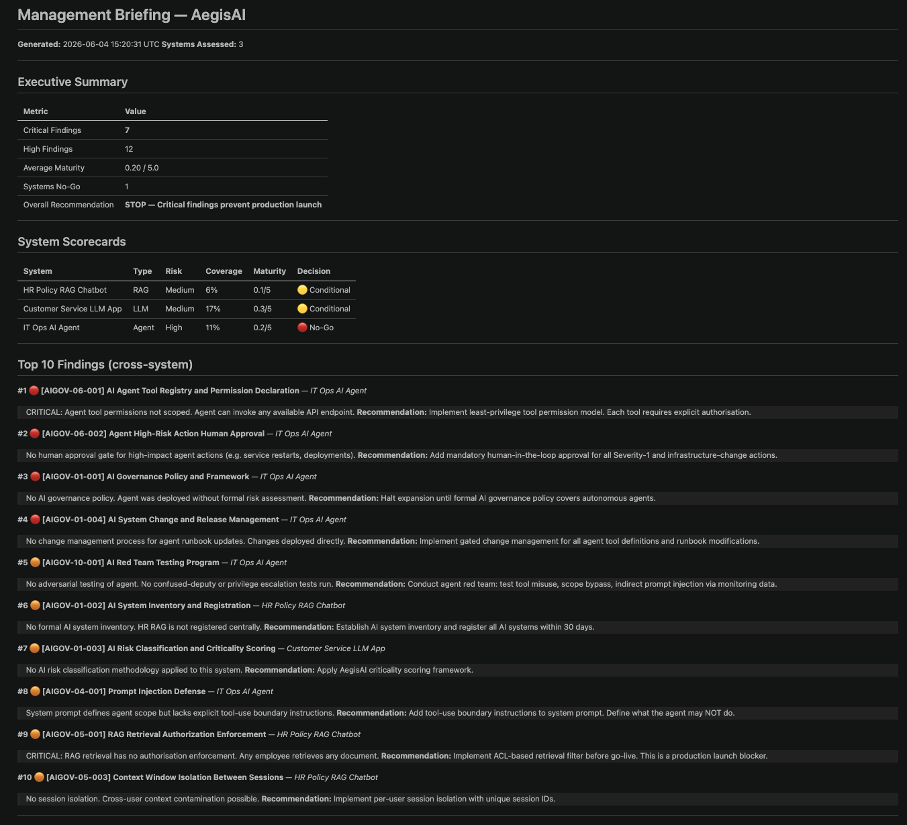
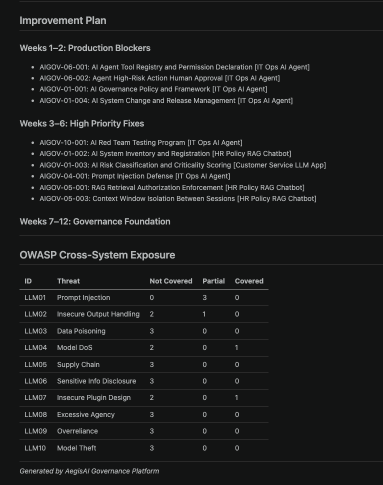

As artificial intelligence adoption scales across the enterprise, security leaders are forced to confront three fundamental questions:
- Which of our AI systems carries the most risk?
- What controls are we missing?
- What do we fix first?

If you don't have concrete answers, it is rarely due to a lack of data. Rather, it is because organizations lack the specialized tooling required to surface and operationalize those insights.

---

## The Infrastructure Gap

Globally, AI adoption is accelerating. The governance infrastructure is not keeping pace.

This isn’t an observation unique to any one country. Taiwan’s regulatory landscape illustrates the pattern clearly: the government has published an AI Playbook for the Public Sector and Guidelines for Generative AI Usage by Executive Yuan Agencies — both thoughtful and necessary documents. But they are frameworks, not operating systems. They describe what organizations should consider, but they do not provide a repeatable way to operationalize AI governance at the system level.

The same pattern exists globally. NIST AI RMF provides a risk management structure. ISO/IEC 42001 defines an AI management system. OWASP LLM Top 10 classifies major LLM application risks. CSA AICM organizes AI security controls across cloud and enterprise environments.

All of these are valuable. None of them, on their own, tell a security team which specific controls are missing from an HR chatbot, whether an IT operations agent should be allowed to execute production actions, or what evidence must be collected before an AI system can pass an internal audit.

The problem is not the absence of frameworks. The problem is the missing operating layer between frameworks and execution.

Most organizations today still lack an integrated way to connect:

* AI system inventory
* risk scoring
* control mapping
* maturity assessment
* technical validation
* remediation ownership
* audit evidence
* management reporting

In other words, the market has frameworks, point solutions, and early governance tools — but most enterprises still do not have a practical infrastructure layer that turns AI governance into a daily operating process.

That is the infrastructure gap.

---

## The Wrong Mental Model

Most organizations approach AI governance the same way the first generation of internet companies approached security: by writing policies.

Policies are necessary. They are not sufficient.

The traditional security stack — firewalls, IDS, SIEM, GRC platforms, vulnerability management, audit tooling — took decades to mature. ISO 27001 governance is tractable today not only because the standard exists, but because an ecosystem of tooling, workflows, evidence collection, and reporting mechanisms grew around it. The policies came first; the infrastructure followed.

AI is being asked to skip that maturation period.

Organizations are already deploying LLMs, RAG systems, copilots, and autonomous agents into production while the equivalent governance infrastructure is still being defined. This creates three practical gaps.

The first is a visibility gap. Security and governance teams often do not have a reliable inventory of AI systems across the business. They may not know who owns each system, what data it processes, whether it connects to tools, whether it can take actions, or whether it is already exposed to external users.

The second is a control translation gap. Frameworks such as NIST AI RMF, ISO/IEC 42001, OWASP LLM Top 10, and CSA AICM describe important risk areas, but engineering teams still need those concepts translated into concrete controls, test cases, remediation tasks, and ownership.

The third is an evidence gap. Even when controls exist, many organizations lack a structured workflow for collecting evidence, assessing control maturity, tracking findings, and producing artifacts that CISOs, auditors, and board-level stakeholders can actually use.

The gap is not philosophical. It is operational.

It is not enough to say that an AI system should be “secure,” “transparent,” or “governed.” The real question is whether the organization can answer, for each AI system:

* What type of AI system is this?
* What data does it process?
* What risks does it introduce?
* Which controls apply?
* Which controls are missing?
* Who owns the remediation?
* What evidence proves the control is working?
* Can this system proceed, or should it be blocked?

That is the gap AegisAI was built to close.

---

## What AegisAI Is

AegisAI is an AI governance audit platform — the governance layer for AI systems that ISO 27001 tooling is for traditional IT.

The workflow is straightforward:

1. Register an AI system in the inventory — its type, architecture, data classification, exposure, autonomy level
2. A risk score is computed automatically from those attributes
3. Applicable security controls are mapped from a 56-control library spanning AIGOV-01 through AIGOV-13
4. A gap assessment surfaces which controls are missing, scored and ranked by remediation priority
5. Output: a structured gap report, per-system findings, and a management briefing with Go/No-Go decisions

The result is the kind of artifact that CISOs, auditors, and GRC teams can actually act on — not a risk heatmap, but a prioritized work order.

---

## Three Systems. Three Completely Different Risk Profiles.

Abstract governance frameworks are easy to agree with. They're hard to act on until you see them applied to a concrete system. Here's a demonstration of what the assessment looks like across three common enterprise AI archetypes.

### HR Policy RAG Chatbot

A retrieval-augmented generation system that answers employee questions about HR policies. Internal-only. Processes PII and financial data.

On the surface, it looks low-risk: internal users, no autonomous actions, human in the loop. The governance assessment tells a different story. A RAG system introduces an entirely different attack surface compared to a standard application — the retrieval pipeline becomes a vector. Without authorization enforcement on retrieval, any authenticated employee can retrieve any document in the corpus, regardless of classification.

**Assessment outcome:** Conditional. The system cannot launch to production until retrieval authorization is implemented. That's a specific engineering task, not an abstract concern.

### IT Ops AI Agent

A semi-autonomous agent that can execute infrastructure operations — service restarts, deployments, configuration changes — based on monitoring data and runbook instructions.

This is categorically different from a chatbot. The consequence of a compromised or misbehaving agent is not a wrong answer — it's a production outage or a lateral movement vector. The governance assessment reflects this: unscoped tool permissions and no human approval gate for high-impact actions together represent the highest-severity findings in the pilot.

**Assessment outcome:** No-Go. Expansion halted until tool permissions are scoped and a human approval workflow is in place for Severity-1 actions.

### Customer Service LLM App

A public-facing LLM application handling customer inquiries. Already in production.

"Already in production" is not a governance pass. It means the clock is already running. The assessment surfaces a missing control that is easy to overlook on a production system: no prompt injection monitoring on the public endpoint. External users are submitting inputs the system was never tested against.

**Assessment outcome:** Conditional. Remain in production; remediate the monitoring gap within 60 days.

### Summarization

The management briefing below consolidates findings from all three systems into a single executive artifact. Seven critical findings, twelve high-severity findings, an average maturity score of 0.20 out of 5.0, and one No-Go verdict. The IT Ops AI Agent is the primary driver of the critical count — unscoped tool permissions and an absent human approval gate are conditions that cannot be accepted in a system with production execution authority. The HR RAG Chatbot and Customer Service LLM App carry Conditional status, each with a specific, bounded remediation required before full clearance.

The improvement plan structures remediation into three phases. Weeks 1–2 address the four production blockers on the IT Ops agent — the findings that justify the No-Go verdict and must be resolved before any further expansion. Weeks 3–6 cover high-priority control gaps across all three systems, including prompt injection defense, retrieval authorization enforcement, and session isolation. Weeks 7–12 establish the governance foundation: system inventory, risk classification methodology, and the red team testing program that prevents new systems from entering production carrying the same gaps. The OWASP cross-system exposure table makes the threat coverage baseline concrete — most categories are currently not covered, which is the expected starting point for an early-stage AI portfolio, not an anomaly.

---

Three systems. Same organization. One No-Go, two Conditionals, different remediation timelines, different engineering owners. Without a governance layer, none of that is visible in a structured way. The risk exists in the system — the platform just makes it legible.

---

## The Framework Stack

AegisAI maps controls across four industry frameworks, each covering a different dimension of AI risk:

**OWASP LLM Top 10** — The security community's threat classification for language model applications. Ten attack categories, from prompt injection to model theft, each with applicable system types and mitigations. The starting point for any security team assessing an LLM deployment.

**NIST AI RMF** — The US government's risk management framework for AI. Structured around four functions: Govern, Map, Measure, Manage. The closest thing to an authoritative lifecycle model for AI risk management.

**ISO/IEC 42001** — The international standard for AI management systems. The framework that will eventually appear in procurement requirements and regulatory audits, in the same way ISO 27001 became non-negotiable for enterprise security vendors.

**CSA AI Controls Matrix (AICM)** — The Cloud Security Alliance's contribution: 18 security domains covering model security, supply chain risk, data protection, identity, and more. Particularly relevant for cloud-deployed AI workloads.

Covering all four matters for a practical reason: an organization operating across jurisdictions — US, EU, APAC — will face requirements anchored in different frameworks. Governance tooling that maps to one but not the others creates blind spots.

---

## What Comes Next

Ten years ago, GDPR was largely discussed as a policy and legal challenge. Today, it is infrastructure: consent management systems, data lineage tooling, data protection officer workflows, breach notification processes, privacy impact assessments, and audit trails. Organizations that built the tooling proactively had a measurable compliance advantage when enforcement arrived. Organizations that treated it as a documentation exercise had to scramble.

AI governance is moving along the same trajectory.

The EU AI Act is already shaping how organizations think about AI risk classification and compliance. NIST AI RMF is becoming a common reference model for AI risk management. ISO/IEC 42001 is creating a management-system path for AI governance. OWASP LLM Top 10 and CSA AICM are helping security teams translate AI-specific threats into actionable control areas.

The signal is clear: AI governance will not remain a policy exercise.

It will become infrastructure.

The gap to close is practical: AI system inventory, risk classification, control mapping, maturity assessment, technical validation, remediation tracking, audit evidence, and management reporting. These are not abstract research problems. They are solvable engineering and governance workflow problems.

AegisAI exists to turn that workflow into an operating layer.

From visibility to assurance.
From risk to remediation.
From framework alignment to audit-ready evidence.

---

## Afterword
If you're working on AI governance, security architecture, or GRC tooling — and especially if you're trying to answer those three questions at the top of this article — I'm happy to walk through the platform or compare notes on the approach.