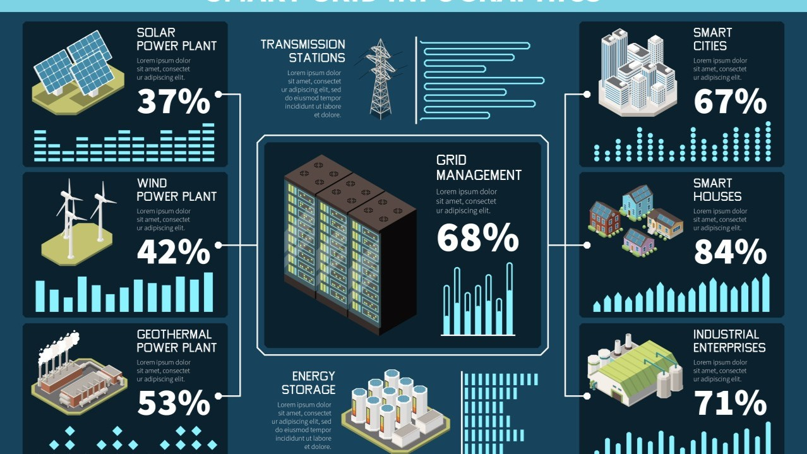

Source: https://www.dreamstime.com/

## 1. Glossary of Technical Terms
- **Telemetry**
    *Definition：* The technology for collecting data from remote devices or systems and transmitting it back to a central control system. The data is typically gathered from sensors or monitoring equipment, such as temperature, pressure, or location.
    *Example：* A space probe transmitting its velocity, temperature, and position data back to Earth is an example of telemetry.

- **Tele-signaling / Remote Signaling**
    *Definition：* Transmission of status or alarm signals from remote equipment, generally as discrete data (e.g., ON/OFF, Normal/Failure).
    *Example：* A power plant control center receiving a “breaker closed” signal from a substation is an instance of remote signaling.

- **Telecontrol / Remote Control**
    *Definition：* Remote operation or control of devices, such as switching equipment on/off, configuring settings, or initiating processes.
    *Example：* Remotely starting a factory machine or turning on an air conditioner is a form of telecontrol.

- **DSP → Digital signal processor**
    *Definition：* A specialized microprocessor designed for high-speed numeric processing, widely used in telecommunications, audio, digital image processing, radar, sonar, and consumer electronics.

- **RTU → Remote terminal unit**
    *Definition：* A microprocessor-based electronic device that acts as an interface to field devices and transmits telemetry data to the SCADA system while also receiving control commands.

- **IED → Intelligent Electronic Device**
    *Definition：* An advanced electronic device capable of data processing and communication, used in power systems and industrial control for monitoring, control, protection, and communication. It goes beyond simple sensors or relays by incorporating microprocessors and communication interfaces.

- **COT → Cause of Transmission**
    *Definition：* A critical field within the ASDU (Application Service Data Unit) in IEC 60870-5, indicating the reason for data transmission (e.g., cyclic, spontaneous, test).

- **IOA → Information Object Address**
    *Definition：* Identifies the internal address of a specific point within a device. Each RTU or IED typically has a point list, and the IOA is used to reference those points.

- **Frame**
    *Definition：* A basic unit of data encapsulation in industrial communication protocols, consisting of a header (Start of Frame, address, function code), payload, and CRC (error check).

- **SCADA → Supervisory Control And Data Acquisition**
    *Definition：* A system architecture used for remote monitoring and control of large-scale industrial systems. SCADA systems enable centralized operators to oversee field devices, send control commands, and visualize/analyze real-time data.

---

## 2. Introduction to the IEC 60870-5 Protocol Series
IEC 60870 is a set of international communication standards developed by the [International Electrotechnical Commission (IEC)](https://www.iec.ch/homepage) for reliable data transmission between industrial control centers (SCADA) and remote devices such as RTUs and IEDs. These standards are widely adopted in **power systems, smart grids, and industrial automation**.

IEC 60870-5 is Part 5 of the standard family and includes over 13 sub-standards focusing on protocols for **remote control, protection, and communication** in power systems.

Two commonly used sub-standards include:
- **IEC 60870-5-101 (IEC 101)**: Designed for serial communication (RS-232/RS-485), suitable for point-to-point local transmission.
- **IEC 60870-5-104 (IEC 104)**: Designed for modern network environments using TCP/IP, enabling wide-area communication via Ethernet or VPN.

In essence, IEC 104 extends the IEC 101 data structure to IP networks, allowing continuous bidirectional connections for real-time data exchange, rather than relying on traditional polling.

---

## 3. Mapping IEC 104 to the OSI Model
IEC 104 functions as an application-layer protocol and uses TCP for transport, typically operating over **Port 2404**.

The mapping to the OSI model is as follows:
- **Application Layer**: IEC 104
- **Transport Layer**: TCP
- **Network Layer**: IP
- **Data Link / Physical Layer**: Ethernet

SCADA systems typically use a **Master-Slave architecture** [1] where **the control center (Master) acts as the Client, and the field devices (RTUs/IEDs) act as Servers**. A persistent TCP connection is established for data exchange and control.

After connection, the client initiates communication with the **StartDT** command. If the server is unresponsive for too long, the **TestFR** command is used to verify the connection.

###### [1] Since 2020, the terms “Master” and “Slave” have come under scrutiny in the tech industry due to their historical association with slavery. Companies like Oracle and GitHub have advocated replacing them with alternatives like **Primary-Replica, Conductor-Member, or Primary-Secondary** to promote more inclusive language. However, as the **IEC standards** were defined before this shift and still reference these terms, we use them here strictly for consistency and clarity in reference to the original documentation.

---

## 4. Communication Format and Data Structure
IEC 104 uses **ASDU (Application Service Data Unit)** as the primary data encapsulation format. Each ASDU contains:
- **Type ID**: Identifies the data type (e.g., telemetry, tele-signaling, telecontrol).
- **Cause of Transmission (COT)**: Indicates the reason for transmission (cyclic, spontaneous, test, command).
- **Common Address / Information Object Address (IOA)**: Identifies the device and data point.
- **Data Content**: The actual transmitted value (e.g., ON/OFF, voltage reading).

IEC 104 frames are categorized into three types:
- **I-frame**: Carries actual data.
- **S-frame**: Acknowledges received data.
- **U-frame**: Manages connection control (StartDT, StopDT, TestFR).

Each message includes sequence numbers for flow control and error detection to ensure reliable delivery.

---

## 5. Real-World Use Case: Integrating with SCADA Systems
IEC 104 is a widely used protocol in modern SCADA systems.
**Examples**:
- Siemens RTUs and WinCC SCADA systems communicate via IEC 104.
- Schneider Electric’s ClearSCADA (Geo SCADA) supports IEC 104.
- ABB’s MicroSCADA and RTU560 include built-in IEC 104 communication modules.

These devices typically interface with IEDs (e.g., smart meters, protection relays) to receive telemetry such as:
- Voltage/current fluctuations
- Protection trip events
- Remote control execution statuses

SCADA systems are configured with matching Type IDs, COTs, and IOAs for each data point.

In cases where legacy field equipment only supports IEC 101 (serial), **protocol converters** or **gateways** (e.g., Advantech [ESRP-PCS-ICR3231](https://www.advantech.com/zh-tw/products/ac0bd5cd-093a-4f88-87f5-13edc68a5616/esrp-pcs-icr3231/mod_803b3db4-bd02-472c-8ad3-624aaaab2433) or [ECU-1051](https://www.advantech.com/zh-tw/products/7332cf9e-bf70-4a79-b0b6-fd8a2182cd72/ecu-1051/mod_0ea5f440-e270-436f-afa3-077df3acce5d)) can be used to convert IEC 101 to IEC 104, enabling integration into modern Ethernet-based systems.

---

## 6. Security Challenges and Protections under IEC 62351
IEC 104 was not originally designed with modern cybersecurity threats in mind, leading to the following issues:
- **Plaintext transmission**, vulnerable to eavesdropping.
- **Lack of authentication**, allowing attackers to impersonate the master station.
- **No encryption or integrity checks**, making it prone to man-in-the-middle attacks.

To address these risks, IEC introduced the [**IEC 62351 series**](https://www.iec.ch/blog/cyber-security-understanding-iec-62351):
- [**IEC 62351-3**](https://webstore.iec.ch/en/publication/68410): Recommends using TLS over TCP (similar to HTTPS) to encrypt data.
- [**IEC 62351-5**](https://webstore.iec.ch/en/publication/65511): Adds signatures and sequence protection at the application layer to prevent spoofing and replay attacks.
- [**IEC 62351-8**](https://webstore.iec.ch/en/publication/61822) & [**IEC 62351-9**](https://webstore.iec.ch/en/publication/66864): Define device authentication and key management methods.

If devices do not support IEC 62351, **VPNs** or **secure gateways** can be used for encrypted communication or packet forwarding.

---

## 7. Practical Recommendations for Secure and Stable Deployment
Even with IEC 62351 in place, the following best practices are recommended:
- **Network Segmentation**: Isolate SCADA and control networks from corporate IT networks.
- **Firewall Port Control**: Restrict access to Port 2404 to authorized IP addresses only.
- **Intrusion Detection Systems (IDS)**: Monitor abnormal IEC 104 traffic and command patterns.
- **Secure Gateways**: Enforce data and command restrictions based on IOA and Type ID.
- **VPN Encryption**: Use secure channels for remote access.
- **Firmware Updates**: Regularly patch known vulnerabilities in devices.
These strategies form a **defense-in-depth** approach, significantly reducing the risk of successful cyberattacks.