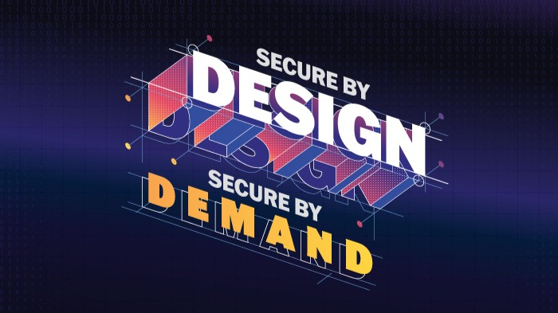

Source: Cybersecurity and Infrastructure Security Agency 

In response to the growing cybersecurity threats facing today’s Industrial Control Systems (ICS) and Operational Technology (OT), the U.S. Cybersecurity and Infrastructure Security Agency (CISA), the National Security Agency (NSA), the Federal Bureau of Investigation (FBI), along with several international government partners, jointly released the “[Secure by Demand – Priority Considerations for Operational Technology Owners and Operators When Selecting Digital Products](https://www.cisa.gov/resources-tools/resources/secure-demand-priority-considerations-operational-technology-owners-and-operators-when-selecting)” on January 13, 2025.

This guide provides OT asset owners and operators with a set of **security-centric procurement priorities**, aimed at accelerating the shift from “***Secure by Design***” to “***Secure by Default***” across the digital product supply chain.

---

## Why Should OT Security Start with Procurement?
Historically, OT systems have emphasized availability and stability, often at the cost of integrated cybersecurity.

Today, attackers no longer target a single organization—they exploit **common vulnerabilities** in OT products such as weak passwords, default credentials, insecure protocols, and lack of logging mechanisms. A successful intrusion can lead to **widespread compromise** across industries and infrastructure sectors.

**Secure by Demand** represents a mindset shift:

> **Rather than relying on buyers to patch security gaps post-deployment, it calls for vendors to deliver secure-by-default products from the outset.**

---

## 12 Security Priorities for Selecting OT Products
**1. Configuration Management**
Must include change tracking, authorization verification, and secure backup mechanisms to prevent persistent malicious configurations.

**2. Baseline Logging Support**
Logging of logins, configuration changes, and anomalies should be enabled by default, using open standard formats.

**3. Open Standards Compliance**
Adoption of interoperable protocols (e.g., [OPC UA](https://en.wikipedia.org/wiki/OPC_Unified_Architecture), [TLS](https://en.wikipedia.org/wiki/Transport_Layer_Security)) to enhance portability and prevent vendor lock-in.

**4. Operational Autonomy**
Buyers must retain full control over system maintenance and not be dependent on vendor-exclusive services or restricted from deploying their security tools.

**5. Data Protection**
Ensure the confidentiality and integrity of engineering logic, configuration files, and operational data to prevent theft or tampering.

**6. Secure by Default**
Devices should ship with hardened settings, **disable default passwords and insecure services**, and include all security features out of the box.

**7. Secure Communications**
Must support certificate-based authentication and provide a **simple deployment process**, even for non-cybersecurity professionals.

**8. Resilience Against Malicious Commands**
Capable of detecting and rejecting unauthorized or unexpected commands to prevent safety incidents or system disruption.

**9. Strong Authentication**
Must support phishing-resistant **Multi-Factor Authentication (MFA)** and role-based access control to avoid shared credentials and identity abuse.

**10. Threat Modeling Capability**
Vendors must provide up-to-date threat models and mitigation strategies to assist buyers in security risk assessments.

**11. Vulnerability Management**
It should follow comprehensive CVE processes, support coordinated vulnerability disclosure (CVD), and include **Software Bill of Materials (SBOM)** — all while offering free security updates.

**12. Upgrade and Patch Tooling**
Must support secure update verification, well-documented upgrade procedures, and **seamless OS migration** without additional cost.

---

## Cultivating a Culture of Secure Procurement: The Buyer’s Role
> **At the core of Secure by Demand is a powerful message: Buyers are the first line of defense in OT cybersecurity.**

By demanding products that meet the above security priorities, buyers can:

- **Incentivize vendors** to integrate cybersecurity into product design
- **Avoid high costs** associated with late-stage remediation
- **Proactively address compliance** with emerging regulations like the EU’s [NIS2](https://digital-strategy.ec.europa.eu/en/policies/nis2-directive) and [Cyber Resilience Act](https://digital-strategy.ec.europa.eu/en/policies/cyber-resilience-act)

At the same time, this approach facilitates the **gradual replacement of aging, hard-to-update systems**, paving the way for sustainable digital transformation.

---

## Practical Tips for Secure Procurement
- Explicitly define security features and certification standards (e.g.,[ ISA/IEC 62443](https://www.isa.org/standards-and-publications/isa-standards/isa-iec-62443-series-of-standards)) in procurement documents
- Evaluate whether vendors provide **free vulnerability remediation** and long-term security support
- Require **threat models, SBOMs, and secure design documentation** as part of vendor deliverables
- Prioritize products that support **MFA, zero-trust architecture**, and **open standards**

---

## Conclusion: Cybersecurity is Not Just a Technical Concern - It’s a Procurement Decision
**Secure by Demand** reinforces a critical truth:
>**If security is not built-in by default, the ultimate cost will be much higher.**

For OT asset owners, procurement marks the beginning of the security journey.

For vendors, embedding security into products is no longer optional—it’s a competitive differentiator.