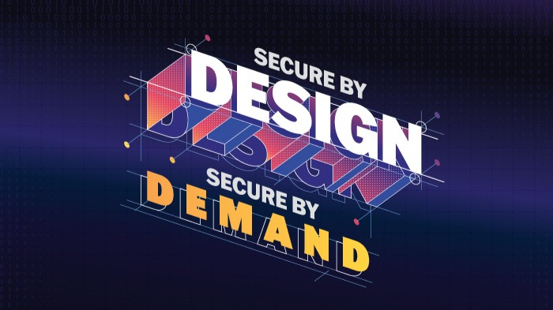

Source: Cybersecurity and Infrastructure Security Agency

在現今工業控制系統（ICS）與營運技術（OT）面臨日益嚴峻的網路威脅下，CISA、NSA、FBI 協同多國政府單位於 2025/1/13 聯合發布《[Secure by Demand - 營運技術所有者和營運商選擇數位產品時的優先考慮事項](https://www.cisa.gov/resources-tools/resources/secure-demand-priority-considerations-operational-technology-owners-and-operators-when-selecting)》指南，提供 OT 系統採購者一套以資安為主軸的產品選購優先事項，藉此推動供應鏈從「***Secure by Design***」邁向「***Secure by Default***」。

---

## 為什麼 OT 安全必須「從採購開始」？
傳統 OT 系統長期以可用性與穩定性為優先，導致資安設計被犧牲。如今攻擊者不再針對單一企業，而是鎖定共通的 OT 弱點 (諸如弱密碼、預設憑證、不安全協定與缺乏日誌機制......等)，一但駭客進行攻擊即會造成大規模淪陷。

> **Secure by Demand 轉變思維：不再仰賴買家後期彌補資安漏洞，而是從產品選型階段，要求供應商預設具備資安防護機制。**

---

## 12 項 OT 產品安全選購重點
1. **組態管理（Configuration Management）**：須具備變更記錄、授權驗證與安全備份機制，防止惡意配置被持久化。

2. **基線日誌支援（Baseline Logging Support）**：預設支援記錄登入、組態變更、異常等事件，並使用開放標準格式。

3. **開放標準支援（Open Standards Compliance）**：採用通用協定（如 [OPC UA](https://en.wikipedia.org/wiki/OPC_Unified_Architecture)、[TLS](https://en.wikipedia.org/wiki/Transport_Layer_Security)）提升可移植性與相容性，避免綁定單一廠商。

4. **操作自主權（Operational Autonomy）**：買方應可獨立維護系統，不應被強制綁定供應商的專屬服務或限制安全工具安裝。

5. **資料保護（Data Protection）**：保護工程邏輯、組態與操作數據的機密性與完整性，避免被竊取或偽造。

6. **預設安全設定（Secure by Default）**：設備出廠即封鎖不安全服務、停用預設密碼並預載強化設定。

7. **安全通訊（Secure Communications）**：支援憑證驗證，並簡化部署流程，使非資安專家亦可完成加密連線設定。

8. **安全控制指令處理（Resilience Against Malicious Commands）**：具備辨識惡意或非預期指令的能力，避免被用於觸發故障或安全事件。

9. **強化身份驗證（Strong Authentication）**：採用 [MFA](https://en.wikipedia.org/wiki/Multi-factor_authentication)、多層權限管理，避免共用帳號與釣魚攻擊。

10. **威脅建模能力（Threat Modeling Capability）**：製造商需提供詳細威脅模型與對應防禦機制，協助買方風險評估。

11. **弱點管理（Vulnerability Management）**：具備完整 CVE 處理流程、漏洞揭露政策與 SBOM（軟體物料清單），並免費提供安全更新。

12. **更新與修補機制（Upgrade and Patch Tooling）**：提供自動驗證更新、相關文件完善的升級流程、並支援無縫移轉至新作業系統。

---

## 建立安全採購文化：買方的角色轉變
> **Secure by Demand 的關鍵在於：買方成為 OT 安全的第一道關卡。**

透過要求上述安全特徵，買方可：
- **驅動廠商強化產品資安設計**
- **避免後期補救導致高昂成本**
- **提前因應歐盟 [NIS2](https://digital-strategy.ec.europa.eu/en/policies/nis2-directive)、[Cyber Resilience Act](https://digital-strategy.ec.europa.eu/en/policies/cyber-resilience-act) 等合規要求**

同時，也能逐步汰換使用壽命長、難以更新的老舊設備，為數位轉型鋪路。

---

## 建議採購流程實踐要點
- 在招標文件中明確要求安全功能與驗證標準（如 [ISA/IEC 62443](https://www.isa.org/standards-and-publications/isa-standards/isa-iec-62443-series-of-standards)）
- 評估供應商是否提供免費的漏洞修補與資安支援週期
- 要求提供產品威脅模型、SBOM、安全設計白皮書
- 優先選用支援 MFA、零信任架構、開放標準的產品

---

## 結語：資安，不只是技術問題，更是採購決策
>**Secure by Demand 強調：若安全不是預設，最終將付出更高代價。**

對 OT 業主而言，採購就是防線起點；對廠商而言，產品內建資安就是未來競爭力的關鍵。