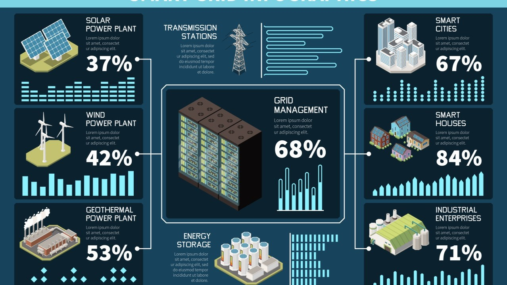

Source: https://www.dreamstime.com/

## 1. 專有名詞說明

- **遙測 → Telemetry**
    定義：是指從遠端設備或系統收集資料並傳回主系統或控制中心的技術。這些資料通常是感測器或監控裝置所收集的，例如溫度、壓力、位置等
    舉例：太空探測器將自身的速度、溫度、位置等資料傳回地球，這些就是「遙測」數據

- **遙信 → Tele-signaling / Remote Signaling**
    定義：指遠端設備或系統的狀態信號的傳送，主要是傳遞狀態或告警資訊（如開/關、正常/故障等），通常是離散型資料
    舉例：發電廠的控制中心收到某個變電站「開關已關閉」的狀態信號，這就是一種遙信

- **遙控 → Telecontrol / Remote Control**
    定義：指從遠端對設備進行控制或操作，例如遠端開關機、設定參數、啟動程式等
    舉例：遠端控制工廠機械啟動運轉、開啟空調等，這些都屬於遙控

- **DSP → Digital signal processor (數位訊號處理器)**
    定義：是一種專用於數位訊號處理的微處理器，被廣泛應用於電信、音訊處理、數位圖像處理、雷達、聲納等領域，以及消費電子產品中

- **RTU → Remote terminal unit (遠端遙控裝置)**
    定義：微控制處理器，主要做為裝置介面的電子裝置，將資料引入 SCADA，通過傳輸遙測資料 (Remote sensing data) 到主系統，並且使用主監控系統的資料控制所連接的裝置

- **IED → Intelligent Electronic Device (智慧電子設備)**
    定義：具備資料處理能力與通訊功能的電子裝置，常應用於電力系統、工業控制系統（ICS）等場景中，用於監測、控制、保護與通訊。它不只是「感測器」或「繼電器」，而是具有 微處理器、邏輯判斷、遠端通訊能力的智慧設備。

- **COT → Cause of Transmission (傳送原因)**
    定義： COT 是 IEC 60870-5 協定中 ASDU（應用服務資料單元）的一個重要欄位，用來說明這筆資料為什麼被傳送，也就是傳輸的「觸發原因」

- **IOA → Information Object Address (資訊物件地址)**
    定義：用來標示該筆資料所屬的設備內部地址，也就是某個遙測點的「點號」。通常每個 RTU 或 IED 裝置裡會配置一張遙測點號表，IOA 就是用來定位這些點

- **Frame → 訊框**
    定義：在工控通訊協定中，Frame 是一個用來封裝與傳輸資料的基本單位，就像是一個信封一樣，裡面包含了標頭 (header)、資料本體 (payload)、檢查碼 (CRC) 等資訊；其中標頭 (header) 主要由起始符 (Start of Frame, SOF) 、位址/識別位、功能碼 (表示讀、寫等指令) 組成

- **SCADA → Supervisory Control And Data Acquisition (監控與資料採集系統)**
    定義：是一種用於遠端監控與控制大型工業系統的架構，它允許操作人員從中控室監控現場設備的運作狀態，並能發送控制命令。SCADA 可收集、儲存、分析和顯示來自現場感測器和控制設備的資料

---

## 2. 何謂 IEC 60870-5 協定

IEC 60870 是一套是由 [國際電工委員會 (IEC)](https://www.iec.ch/homepage) 制定的國際通訊標準，旨在為在工業控制中心 (SCADA) 及遠端裝置 (如: RTU/IED) 間進行可靠的資料傳輸。現今廣泛應用在電力系統、智慧電網的監控/控制與工業自動化系統中。
IEC 60870-5 則是整個家族中的第五部份，旗下包含多達 13 個子標準，主要針對電力系統的遠端控制、遠端保護和相關通信制定了協議標準。

其中最常見的兩個子標準是：
- **IEC 60870-5-101 (下稱 IEC 101)**：使用傳統串列 (RS-232/RS-485) 方式，適合本地端點對點傳輸應用。
- **IEC 60870-5-104 (下稱 IEC 104)**：是針對現代網路環境 (如: TCP/IP) 設計的版本，針對遠端通訊的傳輸層與應用層設計，可在乙太網、VPN 等廣域網路上進行資料傳輸。

簡單來說，IEC 104 就是把 IEC 101 的資料格式「搬到網路上」，讓它能走在 IP 網路上，而且支援雙向持續連線，讓資料可以即時交換，不用像老系統只能等 SCADA 輪詢。

---

## 3. IEC 104 與 OSI 七層模型的對應
IEC 104 在網路通訊模型中，是應用層協定，透過 TCP 傳輸，預設使用 **Port 2404**。

以下是它在 傳統網路 OSI 七層模型中的對應：
- 應用層：IEC 104
- 傳輸層：TCP
- 網路層：IP
- 資料鏈結層/實體層：Ethernet

在 SCADA 系統中採用的是 Master-Slave 模式 (*註1*)，主站 (控制中心) 通常是 **Client (用戶端)** ，現場的 RTU、IED 是 **Server (伺服端)** ，兩者透過 TCP 建立持久性連線 (Persistent Connection) ，並進行資料交換與控制指令下達。
當主站連線成功後，會送出 **StartDT** 指令開始資料傳送；若無動作太久，也會用 **TestFR** 做連線測試。

###### *註1：自2020年起，美國科技界認為 Master-Slave 這樣的字眼可能反應了早期蓄奴制度而帶有潛在負面與歧視意涵，因而 Oracle、GitHub 等大廠倡議以 Source-Replica 、Conductor-Member 或是 Primary-Secondary 等新名詞取代之；但由於 IEC 相關文件制定時間較早，為讀者們參照方便，此文仍使用 Master-Slave 說明。(參考資料：[MySQL Terminology Updates](https://dev.mysql.com/blog-archive/mysql-terminology-updates/))

---

## 4. 通訊格式與資料結構解說
IEC 104 的資料單元叫做 **ASDU (Application Service Data Unit)** ，是主要的資料封裝格式。

每個 ASDU 包含：
- **類型 ID (Type ID)** ：表示這是什麼資料 (例如遙測、遙信、遙控)
- **傳送原因 (COT)** ：表示為什麼送這筆資料 (定時、變化、指令、測試等)
- **公共地址與資訊物件地址 (IOA)** ：標示資料屬於哪個裝置、哪一筆點位
- **資料內容**：實際傳輸的值 (如 ON/OFF、電壓數值)

IEC 104 使用三種 Frame 類型：
1. **I-frame**：攜帶實際資料
2. **S-frame**：確認對方資料已收到
3. **U-frame**：連線管理指令，如 StartDT、StopDT、TestFR

這些報文 (message) 內含控制編號與確認編號，確保資料正確送達，並支援流量控制與錯誤偵測。

---

## 5. 實際應用案例：如何與 SCADA 整合
在現代 SCADA 系統中，IEC 104 是非常常見的通訊協定。
舉例來說：
- **西門子 (Siemens)** 的 RTU 裝置與 WinCC SCADA 系統可以透過 IEC 104 傳送資料。
- **施耐德電機 (Schneider Electric)** 的 ClearSCADA (Geo SCADA) 也支援 IEC 104。
- **艾波比 (ABB)** 的 MicroSCADA 及 RTU560 裝置內建 IEC 104 通訊模組。

這些裝置通常會與 IED (如：智慧電表、保護裝置) 回傳的遙測訊息串接，例如：
- 電壓/電流變化
- 保護跳脫事件
- 遙控指令執行成功與否

SCADA 系統會設定對應的 Type ID、COT、IOA 等參數，來對應每一筆資料。
在一些場景下，若現場設備只支援 IEC 101 (串列通訊) ，可使用 **協定轉換器** 或 **閘道器** (如：研華生產的轉換器 [ESRP-PCS-ICR3231](https://www.advantech.com/zh-tw/products/ac0bd5cd-093a-4f88-87f5-13edc68a5616/esrp-pcs-icr3231/mod_803b3db4-bd02-472c-8ad3-624aaaab2433) 及閘道器 [ECU-1051](https://www.advantech.com/zh-tw/products/7332cf9e-bf70-4a79-b0b6-fd8a2182cd72/ecu-1051/mod_0ea5f440-e270-436f-afa3-077df3acce5d)) 將其轉成 IEC 104 接入乙太網架構，實現舊系統升級。

---

## 6. 資安挑戰與 IEC 62351 的保護機制

IEC 104 初始設計時並未考慮現代網路威脅，因此面臨以下問題：
- 資料採用明文傳輸，容易有遭竊聽的風險
- 缺乏身份驗證機制，攻擊者可偽裝成合法主站發送指令
- 沒有加密與完整性驗證，易遭中間人攻擊

為了解決這些問題，IEC 推出了 [**IEC 62351** 系列標準](https://www.iec.ch/blog/cyber-security-understanding-iec-62351)，加強電力通訊方面的資安保護：
- [**IEC 62351-3**](https://webstore.iec.ch/en/publication/68410)：建議在 TCP 上使用 TLS (類似 HTTPS) 來加密資料
- [**IEC 62351-5**](https://webstore.iec.ch/en/publication/65511)：對 IEC 104 應用層新增簽章與序號保護，避免重放攻擊 (replay attack) 與偽造
- [**IEC 62351-8**](https://webstore.iec.ch/en/publication/61822) ＆ [IEC 62351-9](https://webstore.iec.ch/en/publication/66864)**：定義了裝置驗證和金鑰管理辦法

若設備不支援這些功能，則可改用 VPN 或閘道器進行加密傳輸或封包轉發。

---

## 7. 實務建議：如何部署安全又穩定的系統
即使已導入 IEC 62351，仍建議採用以下部署建議：
1. **網路區隔**：SCADA、RTU 等工控網路要與一般企業網路隔離。
2. **防火牆控制埠存取**：只允許授權的 IP 連接 Port 2404 。
3. **入侵偵測系統 (IDS)** ：即時監測異常 IEC 104 封包與指令行為。
4. **安全閘道器**：限制只能傳送特定 IOA/Type ID 的資料與指令。
5. **VPN 加密傳輸**：遠端存取建議透過加密通道保護資料。
6. **定期更新設備韌體**：修補既有已知漏洞。

上述策略屬於縱深防禦，能大幅降低攻擊成功的機率。